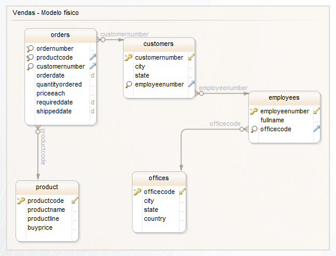
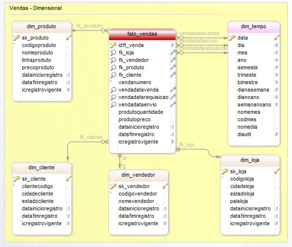

# BI - Praticando as técnicas de modelagem
Com base no modelo de dados em anexo, produzir os entregáveis, seguindo os componentes apresentados em aula para o desenvolvimento de um projeto de Business Intelligence.

## Painel Analítico no PowerBI
- [(Painel Analítico no PowerBI)](https://app.powerbi.com/view?r=eyJrIjoiZmYzNmJlNjYtMDM0OS00NTBlLTkwZDgtNTY3N2ViZGNkMzE2IiwidCI6IjFhMDM0OTQ3LWI2ZDgtNGYzYi1iMGZjLTM0ZDA1YjYzZjlmYiJ9)

## Integrantes do grupo:
-  `Gabriel Henrique Neres de Oliveira`
-  `Helion Nascimento Mendanha`
-  `João Paulo Xavier`
-  `Leonardo Soares da Silva`
-  `Robson Carlos`
-  `Silas André Ferreira Alvarenga`

## Modelo Físico

## Modelo Dimensional
